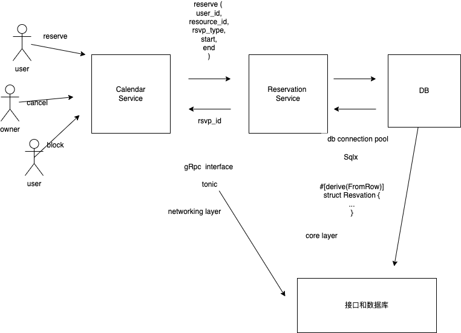

Core Reservation Service
- Feature Name: core-reservation-service
- start Date: Tue Nov 8 20:09:32

## Summary
A core reservation service that solves the problem of reserving a resource for a period of time.We leveage postgres EXCLUDE constraints to ensure that only one reservation can be made for a given resource at a given time.

这里要尝试使用其他方式替换，锁等方式，为了节约时间先将第一版暂定为mysql，postgres需要花更多时间来学习熟悉。
保证一段时间内的资源可用，可能会面出现写入或取消操作时资源已经被占用造成查重负担全表扫判断或者是排队等待，全部放空等问题。
需要对多种场景进行处理。

## Motivation

We need a common solution for vaious reservation requirements:

    1) calendar booking
    2) hotel/room booking
    3) meeting room booking
    4) parking lot booking
    5) etc.
Repeatedly building features for these requirements is a waste of time and resource. We should have a common solution that can be used by all teams.

Guide-level explanation

## Service interface
We would use gRPC as a service interface.Below is the proto definition:


```proto

enum ReservationStatus {
    UNKONOW =0;
    PENDING = 1;
    CONFIRMED = 2;
    BLOCKED = 3;
}

enum ReservationUpdateType {
    UNKNOW =0;
    CRATE = 1;
    UPDATE = 2;
    DELETE = 3;
}

message Reservation {
    string id =1;
    string user_id = 2;
    ReservationStatus status = 3;// for user show type infomeration

    // resource reservation window
    string resource_id =4;
    google.protobuf.Timestamp start = 5;
    google.protobuf.Timestamp end = 6;

    //exta note
    string note = 7;
}

message ReserveRequest {
    Reservation reservation =1;
}
message ReserveResponse {
    Reservation reservation =1;
}

message ConfirmRequest {
    string id =1;
}

message ConfirmResponse{
    Reservation reservation =1;
}

//
message UpdateRequest {
    string note =2;

}
message UpdateResponse{
    Reservation reservation =1;
}
message CanceRequest {
    string id = 1;
}
message CanceResponse{
    Reservation reservation = 1;
}
message GetRequest {
    string id =1;
}
message GetResponse {
     Reservation reservation = 1;

}
message QueryRequest {
    string resource_id =1;
    string user_id =2;
    //user status to filter  results.if unknow return all reservations
    ReservationStatus status =3;
    google.protobuf.Timestamp start =4;
    google.protobuf.Timestamp end = 5;
}

message ListenRequest{} //链接后一直监听资源

service ReservationService {
    rpc resrve(ReserveRequest) returns (ReserveResponse);
    rpc confirm(ConfirmRequest) returns (ConfirmResponse);
    rpc update(UpdateRequest) returns (UpdatedResponse);
    rpc cancel(CancelRequest) returns (CancelResponse);
    rpc get(GetRequest) returns (GetResponse);
    rpc query(QueryRequest) returns (stream Reservation);//
    //another system could monitor newly added/confirm
    rpc listen(ListenRequest) returns (stream Reservation);
}

```

## Database schema

- 数据库选型
  - 迁移成本高
  - 并发情况下的冲突，锁

目前 postgres 似乎试产份额逐渐增强，国外很多公司都在使用，国内暂时不是特别多。同时使用两种数据进行后期的学习增加对比。

use postgres as the database. schema
```sql
CREATE SCHEMA rsvp;

CREATE TABLE resp.reservation_status as ENUM (
    'unknow', 'pending','confirmed','blocked'
);

CREATE TABLE rsvp.reservations(
    id uuid NOT NULL DEFAULT uiid_generate_v4(), /* update  resource */
    user_id varchar(64) NOT NULL, /* user's resource */
    status rsvp.reservation_status NOT NULL
    DEFAULT 'pending',
    resource_id varchar(64) NOT NULL,
    start timestampz NOT NULL,
    end timestampz NOT NULL,
    note text,
  /*  create_at time
    update_at, */
    CONSTRAINT reservation_pkey PRIMARY KEY (id),
    CONSTRAINT reservation_conflict EXCLUDE USING gist (resource_id)
    WITH = , timspan WITH &&)
);

CREATE INDEX reservation_resource_id_idx ON rsvp.reservations (resource_id);
CREATE INDEX reservation_user_id_dx ON rsvp.reservations(user_id);

-- 应用层或数据层，根据条件查询范围，是否可以设置预约,放在哪理可以方便实现
-- if user_id is null find all reservations within during for the resource
-- if resource_id is null ,find all reservations within during for the user
-- if both are null ,find all reservations within during
-- if both set ,find all reservations within during for the resource and user
CREATE OR REPLACE FUNCTION rsvp.query(user_id text, resource_id text,during :TSTZRANAGE)
RETURSE TABLE rsvp.reservations AS $$ $$ LANGUAGE plpgsql

-- grpc 新插入的和更新的增加notify
-- 数据重连的notify 无法监听，直接记录取全部后删掉
-- trigger for add/update/delete a reservation

CREATE OR REPLACE FUNCTION rsvp.resvations_trigger() RETURNS
BEGIN
    IF TG_OP = 'INSERT' THEN
        INSERT INTO rsvp.reservation_changes (reservation_id, op) VALUES(NEW.id,'create');
    ELSIF TG_OP = 'UPDATE' THEN
    IF OLD.status <> NEW.status THEN
        INSERT INTO resvp.reservation_changes (reservation_id,op) VALUES (NEW.id,'update');
    END IF;
    ELSIF TG_OP = 'DELETE' THEN
        INSERT INTO rsvp.reservation_changes (reservation_id,op) VALUES (OLD.id,'delete');
    END IF;
    NOTIFY reservation_updated;
    RETURN NULL;
END;
$$ LANGUAGE plpgsql;

CREATE TRIGGER reservations_trigger
    AFTER INSERT OR UPDATE OR DELETE ON rsvp.reservations FOR EACH ROW EXECUTE PROCEDURE rsvp.reservations_trigger();
```
Here we use EXCLUDE constaint providede by postgres to ensure that on overlapping reservation cannot be made for a given resource at a given time..

```sql
CONSTRAINT reservations_conflict EXCULUDE   USTING gist (resource_id) WITH =, timespan WITH && )
```

## Core flow


We also use a trigger to notify a channel when a reservation is added/updated/deleted.To make sure even we missed certain messages from the channel when DB connection is down for some reseon, we use a queue to store reservation changes. Thus when we receive a notification,we can query the queue to get all the changes since last time we checked,and once we finished processing all the changes,we can delete them from the queue.

如果使用mysql，trigger改为程序队列处理，或者是使用其他队列缓存，新建表等方式进行处理。
